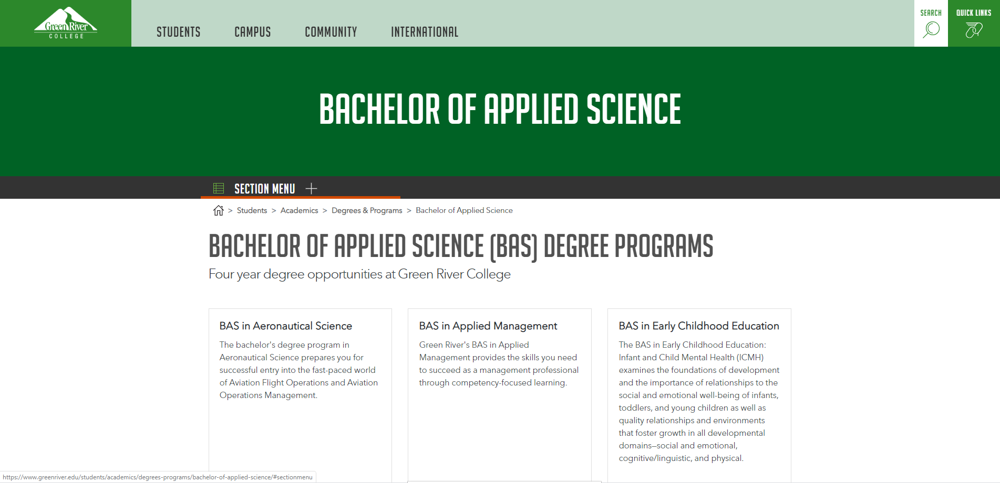

## thisIsAProject

This was a feature that the Green River Valley College contracted me to create to help New Students understand the workload of the degree they were interested in and the life changing opportunities that a degree in IT will bring.

## Features
- [x] User can view a roadmap they will need to complete to finish their degree
- [x] User will be able to understand the opportunities that they will have
- [x] User will be able to view salary and other relevant statistics to their degree
- [x] User will be able to have the syllabus sent to their email entered in

## Challenges I faced creating this Advising Tool

This paticular part I had a difficult in  implementing

[

Code Example
]

I was reading and finally found a solution to implementing this

[

Code Example

]

Finally I finished this and I learned to approach this problem differently by doing Y
